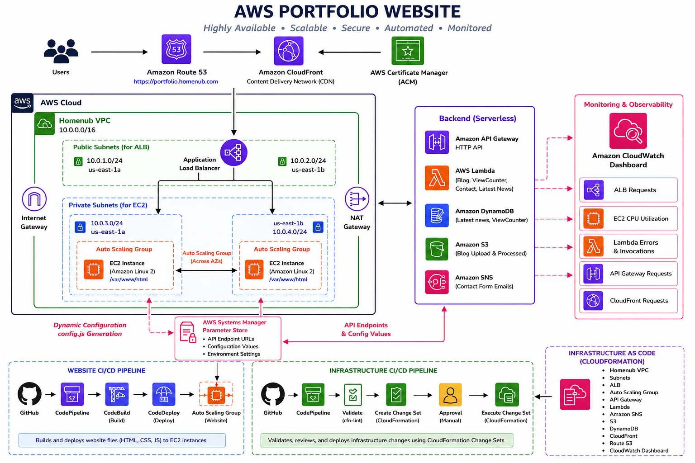
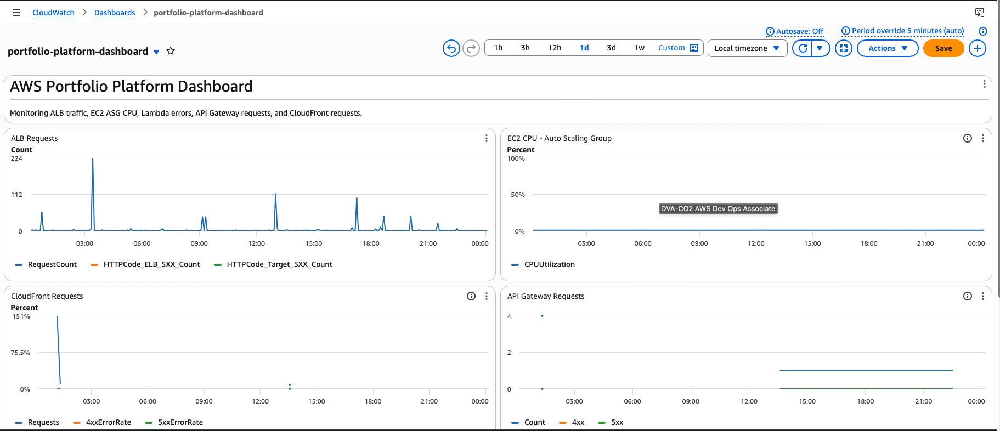
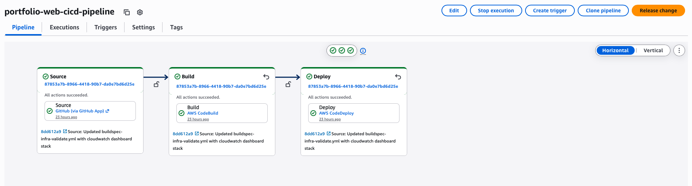
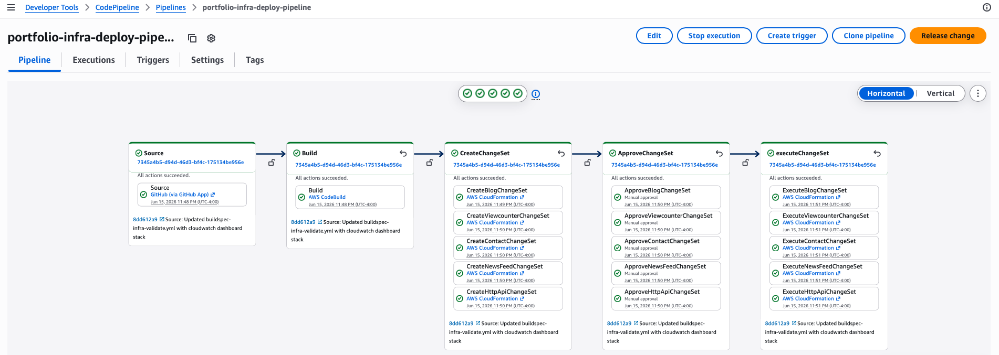
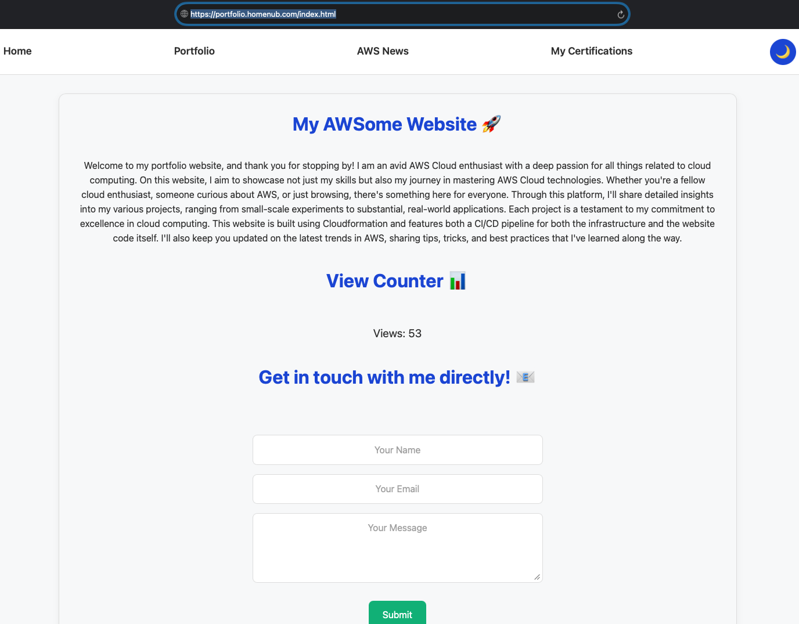
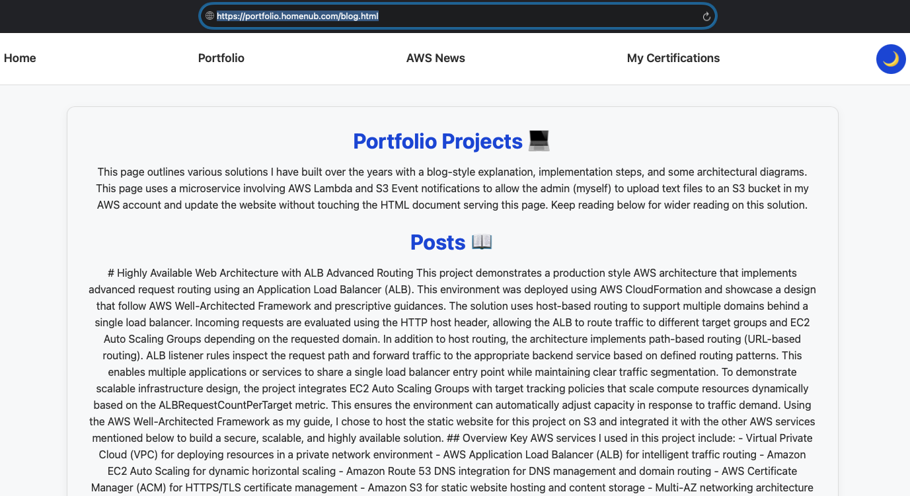
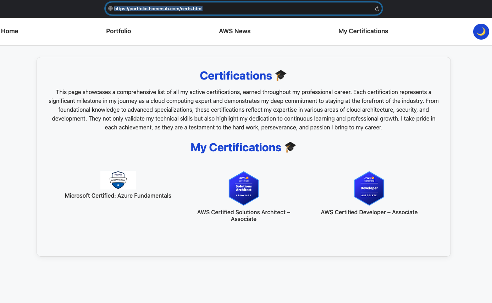
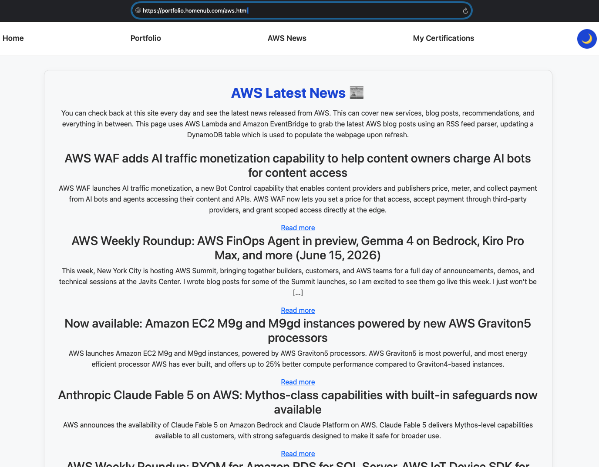

# AWS Serverless Portfolio Platform

## Overview

This project demonstrates the migration of a traditional single-server portfolio website into a highly available, scalable, and partially serverless AWS architecture.

## Architecture

```text

aws-serverless-portfolio-platform
│
├── website/
│   ├── index.html
│   ├── blog.html
│   ├── aws.html
│   ├── certs.html
│   ├── config.js
│   ├── index.js
│   ├── blog.js
│   ├── aws.js
│   └── style.css
│
├── cloudformation/
│   ├── vpc-auto-ssm.yaml
│   ├── alb-ssm-string-fix.yaml
│   ├── asg-web-ssm-string-fix.yaml
│   ├── blog.yaml
│   ├── viewcounter.yaml
│   ├── contactform-updated-v3.yaml
│   ├── awslatestnews-updated-v3.yaml
│   ├── http-api-auto-ssm-v4.yaml
│   ├── cloudfront-route53-production-https.yaml
│   ├── cloudwatch-dashboard.yaml
│   └── parameters/
│       ├── blog-params.json
│       └── contact-params.json
│
├── scripts/
│   └── clean_webroot.sh
│
├── appspec.yml
├── buildspec.yml
├── buildspec-infra-validate.yml
├── buildspec-infra-deploy-backend.yml
├── README.md
│
├── Website CI/CD Pipeline
│   └── GitHub → CodeBuild → CodeDeploy → EC2 Auto Scaling Group
│
└── Infrastructure CI/CD Pipeline
    └── GitHub → Validate → Create Change Set → Approval → Execute Change Set
```

## Screenshots

### Architecture Diagram


### CloudWatch Dashboard


### Website CI/CD Pipeline


### Infrastructure CI/CD Pipeline


### Website screenshots






## Business Problem

The original application relied on a single server and manual deployment processes. The objective was to redesign the platform using AWS services while introducing scalability, automation, monitoring, and deployment controls.

## Solution Highlights

- CloudFront + Route 53 for global content delivery
- Application Load Balancer and Auto Scaling Group
- Serverless backend services using Lambda and API Gateway
- SSM Parameter Store for centralized configuration
- CloudFormation Infrastructure as Code
- GitHub → CodePipeline → CodeBuild → CodeDeploy automation
- CloudFormation Change Sets with approval workflow
- CloudWatch Dashboard for operational monitoring

## Dynamic Configuration Design

Instead of hardcoding API URLs in JavaScript, the website loads configuration from config.js.

The Auto Scaling Group UserData script generates config.js dynamically using values stored in Systems Manager Parameter Store.

Benefits:

- No manual API URL updates
- Consistent configuration across environments
- Easier maintenance
- Reduced deployment risk

## CI/CD Pipelines

### Website Pipeline

GitHub → CodeBuild → CodeDeploy → Auto Scaling Group

Purpose:

- Deploy website content
- Update HTML, CSS, JavaScript
- Preserve infrastructure

### Infrastructure Pipeline

GitHub → Validate → Create Change Set → Manual Approval → Execute Change Set

Purpose:

- Validate CloudFormation templates
- Review infrastructure modifications
- Deploy backend services safely

## CloudWatch Dashboard

One of the most valuable additions to the project was a centralized CloudWatch Dashboard.

Metrics include:

- ALB Requests
- EC2 CPU Utilization
- Lambda Errors
- API Gateway Requests
- CloudFront Requests

Why it matters:

Many portfolio projects focus only on deployment. This dashboard demonstrates operational ownership by providing visibility into application health, performance, and troubleshooting.

## Lessons Learned

### Auto Scaling Group Launch Template Issue

Problem:
New instances were not receiving updated UserData changes.

Root Cause:
The Auto Scaling Group was not using the latest launch template version during instance refreshes.

Resolution:
Updated the ASG to use the latest launch template version and performed a refresh.

Lesson:
Updating a launch template does not automatically update the ASG configuration.

### Change Set Approval Emails

Problem:
Approval emails were not received consistently from the manual approval stage.

Investigation:
SNS subscriptions, topic configuration, and pipeline settings were validated.

Resolution:
Approvals were performed directly from the CodePipeline console.

Lesson:
Operational processes should not rely solely on email notifications.

### Dynamic Configuration

Problem:
API URLs were initially hardcoded in frontend code.

Resolution:
Implemented dynamic config.js generation from SSM Parameter Store.

Lesson:
Centralized configuration dramatically simplifies deployments and environment management.

## Skills Demonstrated

- AWS CloudFormation
- EC2 Auto Scaling
- Application Load Balancer
- CloudFront
- Route 53
- Lambda
- API Gateway
- DynamoDB
- Systems Manager Parameter Store
- CloudWatch
- CodePipeline
- CodeBuild
- CodeDeploy
- Infrastructure as Code
- Change Management
- Monitoring and Troubleshooting
